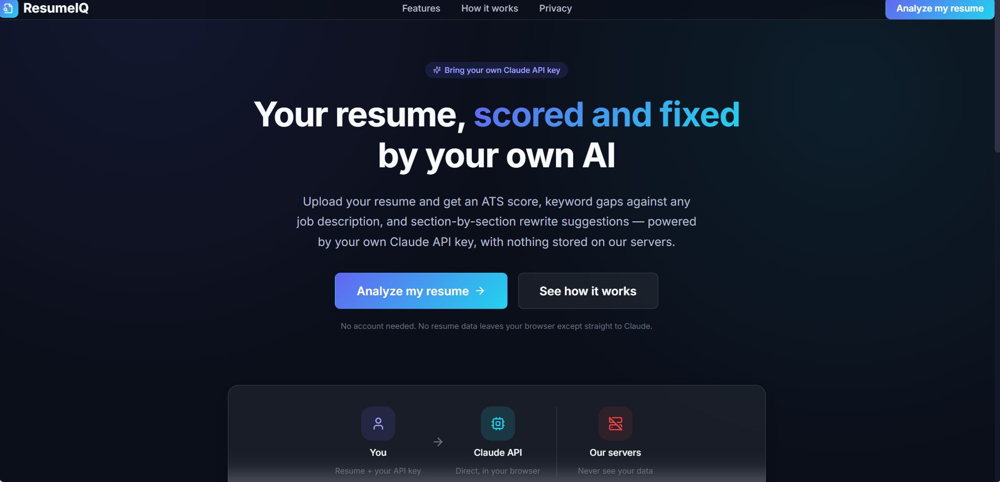
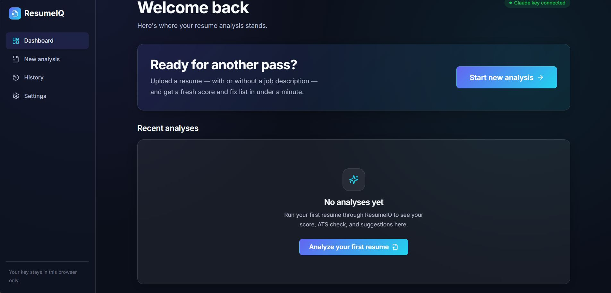

# AI Resume Analyzer

An AI-powered Resume Analyzer that helps users analyze resumes, identify skills, and receive personalized improvement suggestions using a Bring Your Own AI (BYOAI) architecture.

Users can connect their preferred AI provider, including Google Gemini, OpenAI, and Anthropic Claude.

## ✨ Features

- Support for multiple AI providers
  - Google Gemini
  - OpenAI
  - Anthropic Claude
- Resume analysis workflow
- Personalized improvement suggestions
- Clean and responsive interface
- Browser-based application
- BYOAI architecture

## 🚀 Technologies Used

- HTML
- CSS
- JavaScript
- BYOAI Architecture

## 📷 Screenshots

### 🏠 Home Page

### 📄 Resume Upload

## 🚧 Project Status

The frontend interface and BYOAI architecture are implemented. AI provider functionality requires a valid API key with available credits.

## 🎯 Purpose

This project was created as part of my AI portfolio to demonstrate practical AI application development, prompt engineering, user interface design, and multi-provider AI integration.

## ⚙️ Setup

1. Clone this repository
2. Open `index.html` in your browser
3. Add your preferred AI provider API key
4. Configure the AI provider connection

Note: An active API key with available credits is required for AI functionality.

## 📄 License

This project is intended for educational and portfolio purposes.
